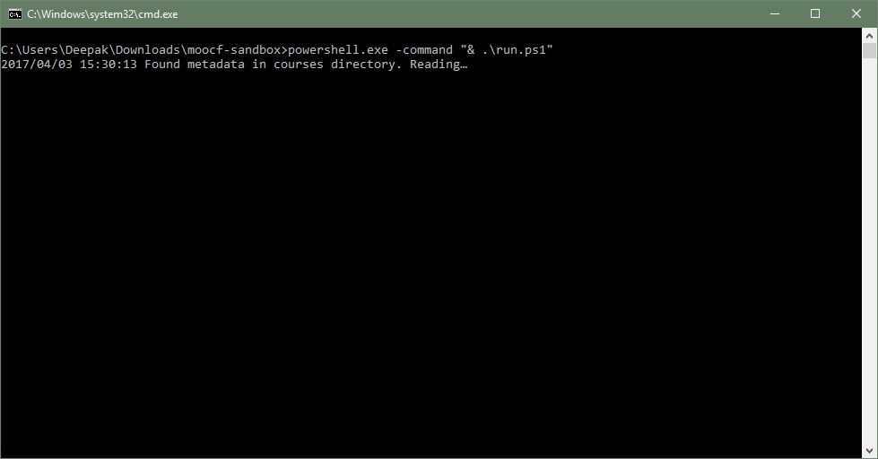

# Introduction
MOOCFetcher Kiosk is a browser-based application that can be used to browse, search and copy MOOCs from a hard drive. MOOCFetcher is a resource for places and communities which do not have access to a high bandwidth internet connection to download large-sized lecture videos and other course materials.

# Prerequisites
Before following this guide, you need to obtain a hard drive containing the MOOCs from us[^contactus], and connect it to a computer on which the MOOCFetcher Kiosk software is going to be installed. The computer that the hard drive is connected to, should have the following software installed:

[^contactus]: Email us at <contact@moocfetcher.com> to get a hard drive containing MOOCs shipped to you.

* Windows 8 Operating System or higher[^osxlinux]
* Google Chrome Browser

[^osxlinux]: MOOCFetcher Kiosk can also run on Linux and OS X operating systems. The instructions are similar, but may need some familiarity with using the commandline. Please contact us for additional instructions.

# Installing MOOCFetcher Kiosk
Normally, the hard drive containing the MOOCs that you have should already contain the MOOCFetcher Kiosk software, and it can be  run directly from it. Follow the instructions in the section below to locate the software on the hard drive, and skip to the next section to start using it. You will still need to follow the installation instructions if you wish to upgrade your current installation of MOOCFetcher Kiosk to a newer one that may be available online.

## Locating Bundled MOOCFetcher Kiosk on Hard Drive
Navigate to the top level folder of the hard disk containing the MOOCs in File Explorer. It should contain the following files:

* _moocfetcher-server.exe_
* _run.ps1_
* _run.bat_

Refer to Figure \ref{moocfroot} below for what the folder would look like.

## Downloading and Installing Latest Release
Open your web browser and navigate to the MOOCFetcher Kiosk releases page:

**<https://github.com/MOOCFetcher/moocfetcher-appliance/releases>**

You should see a page like in Figure \ref{releases}. Download the file **moocfetcher.zip**, and extract the contents into the hard drive containing the MOOCs.

# Using MOOCFetcher Kiosk

### Launching the MOOCFetcher Kiosk application
Navigate to the top level folder of the hard disk containing the MOOCs in File Explorer, and then double-click the file **run.bat**. This should launch the MOOCFetcher Kiosk application in a new window, as shown in Figure \ref{launch}.

## Opening the start page in Google Chrome

Open the Chrome web browser, and navigate to the following location: **http://localhost:8080**.

You should see a screen like in Figure \ref{startpage}.

# Troubleshooting and Questions

If you encounter any problems following the instructions, or have any further questions, please e-mail us at **<contact@moocfetcher.com>**.

